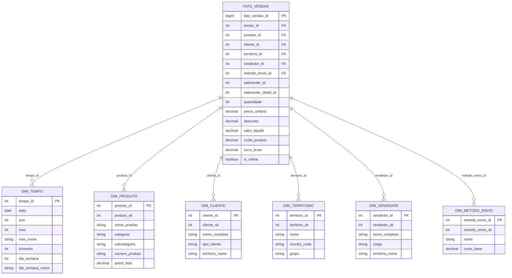

# Diagrama do Modelo Estrela - Data Warehouse AdventureWorks

## Modelo Dimensional (Star Schema)

## Descrição do Modelo

### Tabela Fato: fato_vendas
- **Granularidade**: Uma linha por item de pedido (orderdetail)
- **Métricas**: 
  - `quantidade`: Unidades vendidas
  - `valor_liquido`: Receita após desconto
  - `lucro_bruto`: Lucro (receita - custo)
  - `preco_unitario`: Preço por unidade
  - `desconto`: Valor do desconto aplicado

### Dimensões:
1. **dim_tempo**: Hierarquia temporal (ano → trimestre → mês → dia)
2. **dim_produto**: Hierarquia de produtos (categoria → subcategoria → produto)
3. **dim_cliente**: Informações de clientes
4. **dim_territorio**: Regiões de venda
5. **dim_vendedor**: Equipe de vendas (opcional)
6. **dim_metodo_envio**: Métodos de entrega

## Estatísticas do Data Warehouse

| Tabela | Registros | Descrição |
|--------|-----------|-----------|
| dim_tempo | 1.461 | 4 anos (2011-2014) |
| dim_produto | 504 | Catálogo de produtos |
| dim_cliente | 19.820 | Base de clientes |
| dim_territorio | 10 | Regiões de venda |
| dim_vendedor | 0 | Não utilizado |
| dim_metodo_envio | 5 | Opções de entrega |
| **fato_vendas** | **124.882** | **Transações de venda** |
