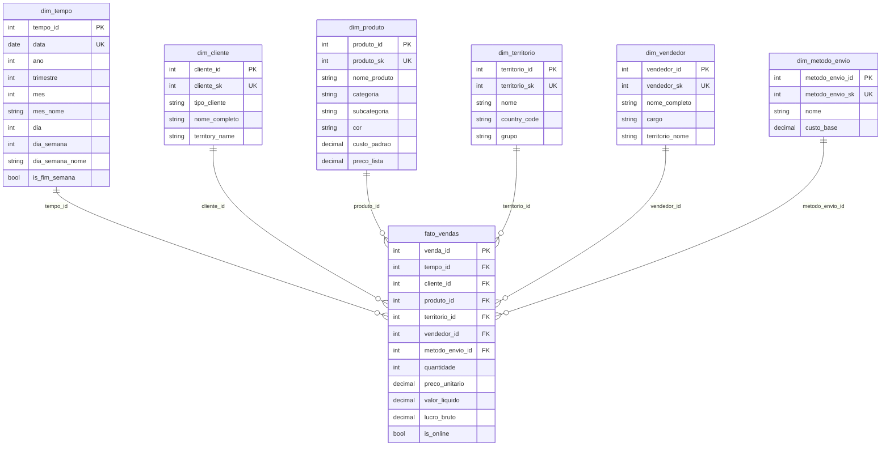

# 📊 Diagrama do Modelo Dimensional (Esquema Estrela)

## Modelo Conceitual



## Representação Textual (para o artigo)

```
                    ┌──────────────┐
                    │  dim_tempo   │
                    ├──────────────┤
                    │ tempo_id (PK)│
                    │ data         │
                    │ ano          │
                    │ mes          │
                    │ dia          │
                    └──────┬───────┘
                           │
         ┌─────────────────┼─────────────────┐
         │                 │                 │
┌────────┴────────┐ ┌─────┴──────┐ ┌────────┴─────────┐
│  dim_cliente    │ │  dim_produto│ │  dim_territorio  │
├─────────────────┤ ├────────────┤ ├──────────────────┤
│ cliente_id (PK) │ │produto_id  │ │territorio_id (PK)│
│ nome_completo   │ │nome_produto│ │ nome             │
│ tipo_cliente    │ │categoria   │ │ grupo            │
└────────┬────────┘ └─────┬──────┘ └────────┬─────────┘
         │                │                  │
         └────────────────┼──────────────────┘
                          │
                  ┌───────▼───────┐
                  │ fato_vendas   │
                  ├───────────────┤
                  │ venda_id (PK) │
                  │ tempo_id (FK) │
                  │ cliente_id FK │
                  │ produto_id FK │
                  │ territorio FK │
                  │ vendedor_id FK│
                  │ metodo_env FK │
                  ├───────────────┤
                  │ quantidade    │
                  │ preco_unit    │
                  │ valor_liquido │
                  │ lucro_bruto   │
                  │ is_online     │
                  └───────┬───────┘
                          │
         ┌────────────────┼────────────────┐
         │                                 │
┌────────┴─────────┐            ┌─────────┴────────┐
│  dim_vendedor    │            │ dim_metodo_envio │
├──────────────────┤            ├──────────────────┤
│ vendedor_id (PK) │            │ metodo_envio_id  │
│ nome_completo    │            │ nome             │
│ cargo            │            │ custo_base       │
└──────────────────┘            └──────────────────┘
```

## 🎯 Características do Modelo

### Tipo: Estrela (Star Schema)
- Centro: Tabela fato (fato_vendas)
- Pontas: Dimensões desnormalizadas
- Vantagens: Queries simples, alta performance

### Granularidade
**Item de Pedido** - Cada linha representa um produto vendido em um pedido específico.

### Dimensões (6)
1. **Tempo** - Quando a venda ocorreu
2. **Cliente** - Quem comprou
3. **Produto** - O que foi comprado
4. **Território** - Onde foi vendido
5. **Vendedor** - Quem vendeu
6. **Método de Envio** - Como foi entregue

### Fato (1)
**Vendas** - Transações de vendas com métricas quantitativas

### Métricas na Tabela Fato
- **Aditivas:** quantidade, valor_liquido, lucro_bruto
- **Semi-aditivas:** preco_unitario (média)
- **Não-aditivas:** is_online (flag)

### Relacionamentos
- Cardinalidade: 1:N (dimensão:fato)
- Chaves: Surrogate keys (IDs autoincrementais)
- Integridade: Foreign keys com referências explícitas

## 📐 Para o Artigo

### Recomendação
Para o artigo acadêmico, recomendo criar o diagrama usando:
1. **Draw.io** (https://app.diagrams.net/) - Gratuito
2. **Lucidchart** (https://www.lucidchart.com/) - Versão estudante
3. **ERDPlus** (https://erdplus.com/) - Específico para ER

### Elementos a incluir no diagrama:
- ✅ Nome das tabelas
- ✅ Chaves primárias (PK)
- ✅ Chaves estrangeiras (FK)
- ✅ Principais atributos
- ✅ Relacionamentos (1:N)
- ✅ Legenda explicativa

### Caption sugerida:
"Figura 1 - Modelo Dimensional em Esquema Estrela do Data Warehouse AdventureWorks. A tabela fato central (fato_vendas) armazena as métricas de vendas e conecta-se a seis dimensões desnormalizadas, permitindo análises multidimensionais eficientes."
